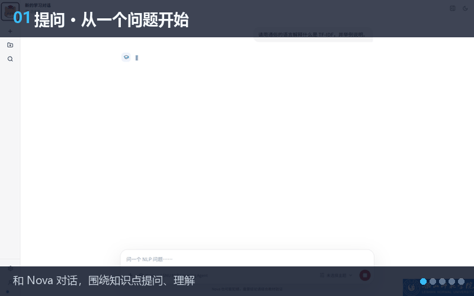

# Nova

<p align="center">
  
</p>

<p align="center">
  <strong>Nova</strong> is an assistant for natural-language-processing (NLP) teaching and learning — start from a single question, and make asking, understanding, practice and review effortless.
</p>

<p align="center">
  
</p>

<p align="center">
  <a href="#quick-start">Quick Start</a> ·
  <a href="README.md">中文</a> ·
  <a href="CONTRIBUTING.md">Contributing</a> ·
  <a href="LICENSE">License</a>
</p>

## Four views

| Learner | Teacher |
| --- | --- |
|  |  |

| Developer | Monitor |
| --- | --- |
|  |  |

---

## Quick Start

### Install and run

Requires Python 3.11 or newer and [uv](https://docs.astral.sh/uv/).

```powershell
uv sync                                   # install dependencies
Copy-Item .env-example .env               # prepare config: model key and database
uv run python main.py bootstrap-db        # initialize the database
uv run python main.py bootstrap-developer # create the first account
uv run python main.py serve               # start the server
```

Once it starts, open <http://127.0.0.1:8765>.

<details>
<summary>macOS / Linux</summary>

```shell
uv sync
cp .env-example .env
uv run python main.py bootstrap-db
uv run python main.py bootstrap-developer
uv run python main.py serve
```

</details>

### Log in and explore

Log in with the account created by `bootstrap-developer`:

- Learner: <http://127.0.0.1:8765/>
- Teacher: <http://127.0.0.1:8765/teacher>
- Developer: <http://127.0.0.1:8765/developer>

You can also chat from the terminal:

```powershell
uv run python main.py chat
```

For the observability monitor, run `uv run python main.py monitor` first, then open <http://127.0.0.1:8766/>.

## Docs

- [Contributing](./CONTRIBUTING.md)
- [Configuration](./docs/)
- [License](./LICENSE)

---

This repository is licensed under the [MIT](./LICENSE) license.
