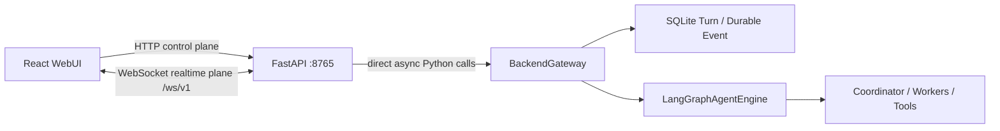

# FastAPI Web Adapter

FastAPI is the same-origin network boundary for the WebUI. It owns HTTP,
WebSocket, database-backed opaque-cookie authentication, CSRF validation,
request validation, and public event names. It never constructs LangGraph,
Coordinator, or Worker objects; the application lifespan starts and closes
exactly one `BackendGateway`.



## Start and lifecycle

```powershell
uv sync
uv run python main.py serve
```

The server binds to `127.0.0.1:8765` by default. Uvicorn must stay at one
worker while the Gateway is embedded. The FastAPI lifespan performs
`gateway.start()` before readiness succeeds. During shutdown it rejects new
turns, closes WebSocket channels, drains active turns for `shutdown_grace_s`,
cancels any remainder, closes Agent-owned resources, and flushes SQLite.

Health probes:

- `GET /health/live`: the ASGI process is alive.
- `GET /health/ready`: the Gateway is initialized and accepting turns.

## Same-origin authentication

1. The WebUI sends `POST /api/v1/auth/login` from the same origin.
2. The server stores only a token digest in `nlp_sessions`, then returns an
   HttpOnly, SameSite=Lax opaque cookie and a CSRF token in the JSON response.
3. Every mutating HTTP request sends `X-CSRF-Token` and an `Origin` header.
4. The browser first calls `POST /api/v1/auth/ws-ticket`; the WebSocket
   handshake uses the one-time, short-lived, origin-bound ticket rather than
   accepting the login cookie directly.

No password or long-lived credential is placed in a WebSocket query string.
Configure MySQL and the four seeded RBAC roles before starting the service. Set
`cookie_secure: true` when serving through HTTPS. Password changes, disabled or
deleted accounts, role changes and explicit session revocation invalidate the
database session immediately.

## HTTP control plane

All business APIs are under `/api/v1`:

- `/auth/session`: establish, inspect, or clear the browser session.
- `/sessions`: create/list sessions; session detail, transcript, turns, delete.
- `/chat/turns`: submit and inspect turns; replay events and cancel.
- `/chat/injections`: insert a new user message into an executing turn.
- `/tool-approvals`: grant a bounded high-risk tool capability.
- `/settings`: read effective runtime information and persist per-user WebUI
  preferences.
- `/protocol`: discover WebSocket commands, events, and limits.

OpenAPI is available at `/api/openapi.json` and interactive documentation at
`/api/docs`.

## WebSocket realtime plane

One `/ws/v1` connection multiplexes any number of sessions, following the same
useful idea as nanobot's WebUI channel. Unlike nanobot's current wire format,
the NLP protocol uses versioned command envelopes and durable event sequence
numbers.

Client command:

```json
{
  "v": "1",
  "type": "chat.send",
  "request_id": "browser-generated-id",
  "payload": {
    "session_id": "session-id",
    "content": "Explain NLP",
    "idempotency_key": "optional-retry-key"
  }
}
```

Server event:

```json
{
  "v": "1",
  "type": "chat.delta",
  "event_id": "durable-event-id",
  "session_id": "session-id",
  "turn_id": "turn-id",
  "sequence": 3,
  "timestamp": "2026-07-17T00:00:00Z",
  "payload": {"delta": "text"}
}
```

Commands are `chat.send`, `chat.inject`, `chat.cancel`, `session.subscribe`,
`session.unsubscribe`, `stream.resume`, and `ping`. `session.switch` is
intentionally absent: selecting a session is frontend state, while
`session.subscribe` controls server event delivery.

For reconnect recovery, the browser sends:

```json
{
  "v": "1",
  "type": "stream.resume",
  "request_id": "resume-id",
  "payload": {"turn_id": "turn-id", "after_sequence": 17}
}
```

The adapter subscribes to live events first, then replays SQLite events. It
deduplicates by `(turn_id, sequence)` and fills detected gaps before delivering
new live events, so a reconnect cannot silently reorder the stream. When old
events have expired, the server emits `stream.gap` and the browser reloads the
final turn or session transcript through HTTP.

Each connection has its own bounded send queue. Publishing never waits on a
slow browser; queue overflow or a send exceeding `ws_send_timeout_s` closes only
that client with code `1013`, after which it reconnects and uses
`stream.resume`. Uvicorn provides protocol-level ping/pong using
`ws_ping_interval_s` and `ws_ping_timeout_s`. Global and per-user connection
limits prevent stalled clients from accumulating without bound.

## Adapting nanobot WebUI

The React layout and rendering components can be reused. Replace its bootstrap
token flow with `/api/v1/auth/session`, replace `new_chat`/`attach`/`message`
frames with the versioned commands above, and map nanobot `delta`,
`reasoning_delta`, `turn_end`, and `session_updated` handlers to `chat.delta`,
`chat.reasoning.delta`, `chat.completed`, and `session.updated`. HTTP history
loads from `/api/v1/sessions/{session_id}/messages`.
